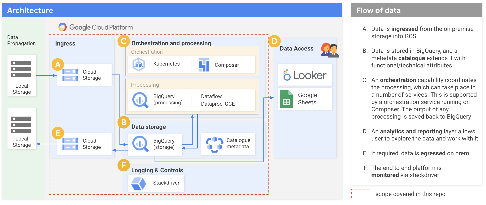

# ```Google Cloud Platform Financial Reporting and Risk Modeling solution```

## _Automate Regulatory reporting workflows on Google Cloud Platform_

_This is a pattern solution architecture, and not a Google Service._

The ```Regulatory Reporting solution``` establishes a regulatory data processing platform using GCP resources. The
platform enables financial institutions to ingest source data, transform it into a coherent and granular data model, and
produce reports tied to specific regulatory requirements for the financial services industry.

The platform's open-source repository is divided into three main sections:
* ```./docs```: contains the project documentation
* ```./common_components```: contains resources that may be used to address most use cases (for example an 
  orchestration capability)
* ```use_cases/examples```: consists of subdirectories housing resources addressing specific regulatory acts or
types of regulatory reporting. 

Currently, the repository contains a few example use cases. All the use cases leverage the same generic architecture,
and each one of them showcases a different aspect of the solution.

A user must understand the applicable regulatory requirements and then carefully configure the solution to produce data
that complies with that particular set of requirements. These configuration steps are outlined in the
below ["Getting Started" section](#getting-started-with-the-regulatory-reporting-solution).

The platform architecture consists of several open-source tools (
including [dbt](https://docs.getdbt.com/docs/introduction)). Some supporting infrastructure, such
as [storage buckets](https://cloud.google.com/storage/) and BigQuery datasets, must be maintained within GCP by users as
a prerequisite. The [Terraform](https://www.terraform.io/intro/index.html) files in this repository can assist with
instantiating that infrastructure.

## Key Features

- Data quality checks, with results piped to a database and/or dashboard
- Pipeline configuration workflow, integrated into a mature development and control process
- Data transformation definition workflow, integrated into a mature development and control process
- Risk model creation, calibration and testing workflow
- Programmatic, rapid, repeatable environment creation

## Getting started with the Regulatory Reporting solution

If you plan to use the Regulatory Reporting solution, you should follow the process detailed in
the [tutorial](./docs/TUTORIAL.md).

## Architecture


## Use cases
The repository contains a number of example use cases, all leveraging the architecture above.

| Use case | Description | Aspect highlighted |
|---|---|---|
| [Home Loan Delinquency](https://github.com/GoogleCloudPlatform/reg-reporting-blueprint/tree/main/use_cases/examples/home_loan_delinquency) | Classify a portfolio of loans into buckets which determine the banding for the days delinquency. | Simple use case highlighting all key aspects of the platform. |
| [Flashing Detection](https://github.com/GoogleCloudPlatform/reg-reporting-blueprint/tree/main/use_cases/examples/flashing_detection) | Detection of Flashing activity on a stock market. Contributed by Strike GTS. | Showcase usage of BigQuery to scale complex analytics to terabytes or beyond of data with no additional operational overhead. |
| [BoE Commercial Real Estate](https://github.com/GoogleCloudPlatform/reg-reporting-blueprint/tree/main/use_cases/examples/boe_cre) | Reporting requirements for Commercial Real Estate, as published by the Bank of England as part of the Transforming the Data Collection programme. | Demonstrate a possible approach to data collection, leveraging granular data requests. |
| [BoE Quarterly Derivatives](https://github.com/GoogleCloudPlatform/reg-reporting-blueprint/tree/main/use_cases/examples/boe_qd) | Reporting requirements for Quarterly Derivatives, as published by the Bank of England as part of the Transforming the Data Collection programme. | Demonstrate a possible approach to data collection, leveraging common data models. |

## Contributing
If you would like to contribute to this project, please consult our [how to contribute](./docs/contributing.md) guide.

## Disclaimers

_This is not an officially supported Google Service. The use of this solution is on an “as-is” basis, and is not a
Service offered under the Google Cloud Terms of Service._

This regulatory reporting solution is under active development. Interfaces and functionality may change at any time.

## License

This repository is licensed under the [Apache License, Version 2.0](https://www.apache.org/licenses/LICENSE-2.0.txt) (
see [LICENSE](LICENSE.txt)). The solution includes declarative markdown files that are interpretable by certain
third-party technologies (e.g., Terraform and DBT). These files are for informational use only and do not constitute an
endorsement of those technologies, including any warranties, representations, or other guarantees as to their security,
reliability, or suitability for purpose.
