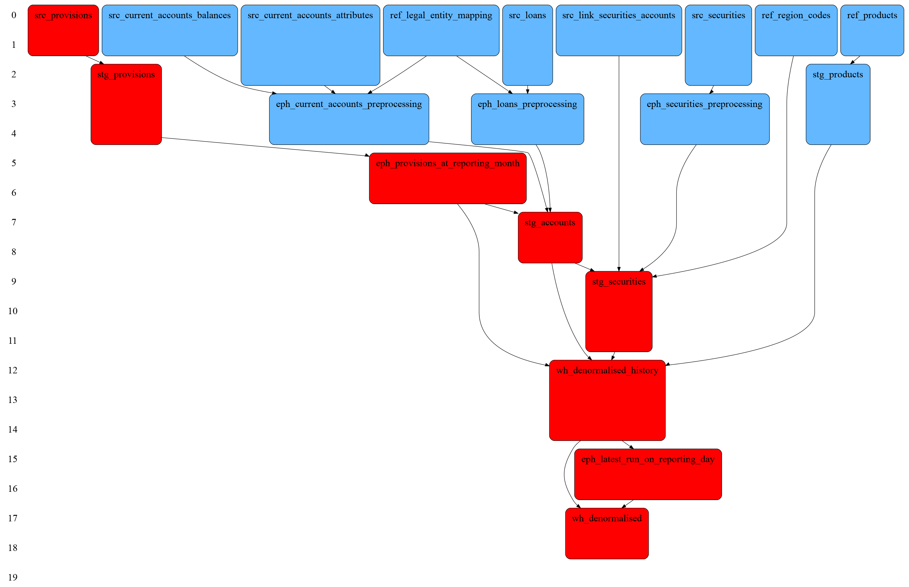
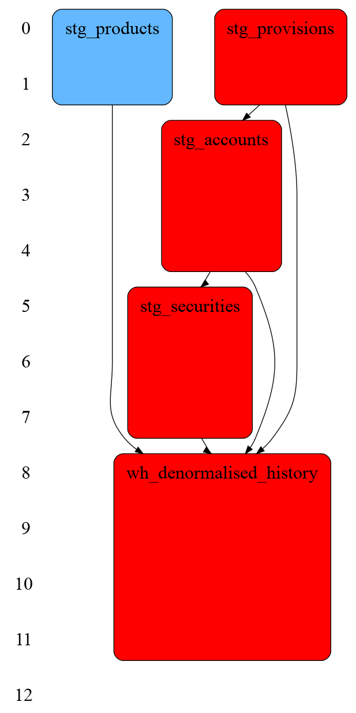

# Regulatory Reporting Monitoring Tools

## Tools

### DBT Logging

DBT Logging Macros [dbt_log](dbt_log) enable logging on DBT start and DBT end
run hooks. These logs contain metadata from the graph (run start) and results
from the runtime (run end), enabling debugging, analysis, and much more.

The provided macros are used for performance graphs.

### DBT Performance Extraction

The [dbt_perf.py](dbt_perf.py) script is used for extracting a JSON document containing the
performance of individual DBT stages and their runtime. This can be from either
the BigQuery DBT logs or from the live BigQuery jobs (for in-progress
executios).

Note that dbt_perf.py requires
[google-cloud-bigquery](https://pypi.org/project/google-cloud-bigquery/)
installed.

### Graphviz DOT graph generation

The [json_to_dot.py](json_to_dot.py) script is used for converting the JSON document of DBT stages
into a DOT graph. This dot graph.

## Running

### Install Graphviz

[Graphviz](https://graphviz.org/) is a command line tool that supports automated
layout of graphs with a variety of output formats (e.g. JPEG, PNG, PDF). It is
used for generating the diagrams.

This can be downloaded and installed on Linux, Mac, and Windows. Instructions
are available here: [Download Graphviz](https://graphviz.org/download/).

### Find a DBT instance

```
./dbt_perf.py --dataset_id "regrep_homeloan"
```

This will display a list of start and end times (if it ended)
of recent DBT runs. Identify a recent run that you want to
analyze.

### Generate graph from a recent DBT instance

Using the dbt_instance_id, substitute it in the command below
to extract, convert, and generate a PNG for the run.

```
./dbt_perf.py --dataset_id "${HOMELOAN_BQ_DEV}" <dbt_instance_id> | ./json_to_dot.py | dot -Tpng > graph.png
```

This will generate the JSON performance graph, convert it to a graphviz DOT
graph, and generated a PNG graph.

## Example Graphs

### Standard

This is an example of the Homeloan use example running like normal with 10
threads.



### All models materialized

Rather than using ephemeral materializations, all of them are turned into table
materializations. This can be configured in dbt_project.yml. This isn't
recommended, but is a good way to observe the increase in number of BigQuery
queries.



## Future Direction

### Render in a Browser

Graphviz has been made available withint D3 using [d3-graphviz](https://github.com/magjac/d3-graphviz).
BigQuery can also be queried using the [google-api-javascript-client](https://github.com/google/google-api-javascript-client)
directly in a browser, allowing for data to be extracted and rendered directly in the browser.
