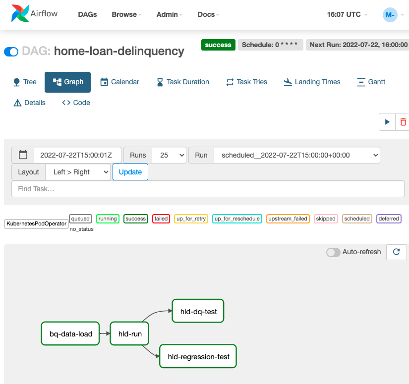

# Standing Up a Cloud-Native Regulatory Reporting Architecture  with BigQuery

## Table of contents
1. [Table of contents](#table-of-contents)
1. [Introduction](#introduction)
1. [Objectives](#objectives)
1. [Costs](#costs)
1. [Before you begin](#before-you-begin)
1. [Prepare your environment](#prepare-your-environment)
1. [Upload the sample data](#upload-the-sample-data)
1. [Run the regulatory reporting pipeline](#run-the-regulatory-reporting-pipeline)
1. [(Optional) Containerize the transformations](#-optional--containerize-the-transformations)
1. [Clean up](#clean-up)
1. [Delete the project](#delete-the-project)
1. [Delete the individual resources](#delete-the-individual-resources)
1. [What's next](#what-s-next)


## Introduction
This document shows you how to get started with the cloud-native regulatory reporting solution and run a basic pipeline. 
It is intended for data engineers who want to familiarize themselves with an architecture and best practices for 
producing stable, reliable regulatory reports. 

In this tutorial, you establish a working example of a regulatory data processing platform on Google Cloud resources. 
The example platform demonstrates how financial institutions can implement a data processing pipeline that meets the 
following requirements of regulatory reporting, but still maintains quality of data, auditability, and ease of change 
and deployment: 

* Ingestion of data from source
* Processing of large volumes of granular data
* Aggregation into reports. 

This document assumes that you’re familiar with Terraform, data build tool (dbt), Cloud Storage, and BigQuery.

------
## Objectives
* Create infrastructure from a cloned repository
* Load manufactured data into BigQuery
* Extract regulatory metrics from granular data
* Containerize the extraction pipeline
* Run the pipeline in Composer

----
## Costs
This tutorial uses the following billable components of Google Cloud:
* BigQuery
* Cloud Storage
* Optionally, Cloud Composer

Use the [Pricing Calculator](https://cloud.google.com/products/calculator) to generate a cost estimate based on your 
projected usage.

-----
## Before you begin
For this reference guide, you need a Google Cloud [project](https://cloud.google.com/resource-manager/docs/cloud-platform-resource-hierarchy#projects). 
You can create a new one, or select a project you already created:

1. Select or create a Google Cloud project.
    [GO TO THE PROJECT SELECTOR PAGE](https://console.cloud.google.com/projectselector2/home/dashboard)

2. Enable billing for your project.
    [ENABLE BILLING](https://support.google.com/cloud/answer/6293499#enable-billing)

3. If you will be using a Cloud Shell instance as your development environment, then in the Cloud Console, activate 
   Cloud Shell.
    [ACTIVATE CLOUD SHELL](https://console.cloud.google.com/?cloudshell=true&_ga=2.175791653.601714487.1648649282-1707141935.1648504534)

    At the bottom of the Cloud Console, a Cloud Shell session starts and displays a command-line prompt. Cloud Shell 
is a shell environment with the Google Cloud CLI already installed and with values already set for your current project. 
It can take a few seconds for the session to initialize.

When you finish this tutorial, you can avoid continued billing by deleting the resources you created. 
See [Clean up](#clean-up) for more detail.

---
## Prepare your environment
1. In Cloud Shell, specify the project that you want to use for this tutorial:
   ```
   gcloud config set project PROJECT_ID
   ```
   Replace PROJECT_ID with the ID of the project that you selected or created for this tutorial. 

   If a dialog displays, click *Authorize*.


2. Specify a default region to use for infrastructure creation:
   ```
   gcloud config set compute/region REGION
   ```

3. Create and activate a Python virtual environment:
   ```
   python -m venv reg-rpt-env
   source reg-rpt-env/bin/activate
   ```

   You see that your command-line prompt is prefixed with the name of the virtual environment.


4. Clone the gitHub repository to your development environment
   ```
   git clone "https://github.com/GoogleCloudPlatform/reg-reporting-blueprint"
   ```


5. Install Terraform. To learn how to do this installation, see the [HashiCorp documentation](https://learn.hashicorp.com/tutorials/terraform/install-cli#install-terraform).


6. [Verify](https://learn.hashicorp.com/tutorials/terraform/install-cli#verify-the-installation) the installation 


7. Install  dbt:
    ```
    sudo pip3 install dbt-bigquery
    ```


8. Verify the dbt installation:
    ```
    dbt --version
    ```

    You see the installation details displayed.


9. Initialize the environment variables: 
    ```
    cd reg-reporting-blueprint && source environment-variables.sh
    ```


10. Run the setup script.
     ```
     cd common_components && ./setup_script.sh
     ```
    
    This will create a `backend.tf` and `terraform.tfvars` files based on the templates.
    If you wish to create a composer infrastructure, manually amand the`terraform.tfvars` so that it 
has `enable_composer=true`  


11. Run terraform to create the required infrastructure
     ```
     cd orchestration/infrastructure/
     terraform init -upgrade
     terraform plan
     terraform apply
     ```

    If you enabled Composer at the step before, you will see a URL for the airflow ui. Click on the link to verify 
    the installation.


13. In the Google Cloud Console, go to the **Cloud Storage** page and check for a bucket with a name like 
`${project}-${region}-ingest-bucket` to verify that an ingest bucket has been created.


14. Go to the **BigQuery** page and verify that the following datasets have been created:
     * homeloan_dev
     * homeloan_data
     * homeloan_expectedresults

----
## Upload the sample data
In this section, you explore  the contents of the repository’s `data `and `data_load` folders, and load sample data 
to BigQuery. 

1. In the Cloud Shell Editor instance, navigate to the data folder in the repository:
    ```
    cd ../../../use_cases/examples/home_loan_delinquency/data/
    ```
    This folder contains two subfolders which are named input and expected.

    Inspect the contents of the input folder. This folder contains CSV files with sample input data. This sample data 
is provided only for test purposes.

    Inspect the contents of the expected folder. This folder contains the CSV files specifying the expected results 
once the transformations are applied.


2. Open, and inspect, the data_load/schema folder, which contains files specifying the schema of the staging data:
    ```
    cd ../data_load
    ```

    The scripts in this folder allow the data to be loaded into Cloud Storage first, and then into BigQuery. 

    The data conforms to the expected schema for the example regulatory reporting pipeline use case in this tutorial.


3. Load the data into Cloud Storage:
    ```
    ./load_to_gcs.sh ../data/input
    ./load_to_gcs.sh ../data/expected
    ```
   
    The data is now available in your Cloud Storage ingest bucket. 


4. Load the data from the Cloud Storage ingest bucket to BigQuery:
    ```
    ./load_to_bq.sh
    ```
    To verify that the data has been loaded in BigQuery, in the console, go to the BigQuery page and select a table in 
both the `homeloan_data` and `homeloan_expectedresults` datasets.

    Select the Preview tab for each table, and confirm that each table has data.


5. To verify that the data has been loaded in BigQuery, in the console, go to the BigQuery page and select a table in 
both the `homeloan_data` and `homeloan_expectedresults` datasets. 
    Select the **Preview** tab of each table and check that data has been populated.

----
## Run the regulatory reporting pipeline
1. In your development environment test the connection between your local dbt installation and your BigQuery datasets 
by running the following command: 
    ```
    cd ../dbt/
    dbt debug --profiles-dir profiles/
    ```
    At the end of the connectivity, configuration and dependency info returned by the command, you should see the 
following message: `All checks passed!`

   In the `models` folder, open a SQL file to inspect the logic of the sample reporting transformations implemented 
in DBT. 


2. Run the reporting transformations to create the regulatory reporting metrics:
    ```
    dbt run --profiles-dir profiles/ 
    ```


3. Run the transformations for a date of your choice:

    ```
    dbt run --profiles-dir profiles/ --vars '{"reporting_day": "2021-09-03"}'
    ```
   
    Notice the variables that control the execution of the transformations. The variable `reporting_day` indicates the 
date value that the portfolio should have. When you run the `dbt run` command, it's a best practice to provide this 
value.


4. In the console, go to the BigQuery page and inspect the `homeloan_dev` dataset. Notice how the data has been populated, 
and how the `reporting_day` variable that you passed is used in the `control.reporting_day` field of the 
`wh_denormalised` view.


5. Inspect the models/schema.yml file:

    ```
    models:
     - <<: *src_current_accounts_attributes
       name: src_current_accounts_attributes
       columns:
         - name: ACCOUNT_KEY
           tests:
             - unique
                  - not_null
    ```
    Notice how the file defines the definitions of the columns and the associated data quality tests. 
For example, the `ACCOUNT_KEY` field in the src_current_accounts_attributes table must be unique and not null.


6. Run the data quality tests that are specified in the config files:
    ```
    dbt test --profiles-dir profiles/ -s test_type:generic 
    ```
   
7. Inspect the code in the ` use_cases/examples/home_loan_delinquency/dbt/tests `folder, which contains `singular` 
tests.  Notice how the tests in this folder implement a table comparison between actual results as outputted by 
the `dbt run` command, and expected results as saved in the `homeloan_expectedresults` dataset.


8. Run the singular tests:
    ```
    dbt test --profiles-dir profiles/ -s test_type:singular
    ```


9. Generate the documentation for the project:
    ```
    dbt docs generate --profiles-dir profiles && dbt docs serve --profiles-dir profiles 
    ```


10. In the output that you see, search for, and then click, the following URL text: http://127.0.0.1:8080
    
    Your browser opens a new tab that shows the dbt documentation web interface.


11. Explore the lineage of the models, and their detailed documentation. You see that  the documentation includes all 
the models’ documentation as specified in the  models/schema.yml files, and all the code of the models.

----
## (Optional) Containerize the transformations
1. Create a container for the BigQuery data load step, and push the container to Google Container Repository:
    ```
    cd ../data_load/     # Note the Dockerfile in this folder
    gcloud builds submit --tag $HOMELOAN_GCR_DATALOAD  # Pushes the image to GCR     
    ```
    The Dockerfile in this directory enables this containerization, which simplifies orchestration of the workflow.


2. Containerize the DBT code for the data transformation step, and push the container to Google Container Repository. 
    ```
    cd ../dbt
    gcloud builds submit --tag $HOMELOAN_GCR_DBT
    ```
    Containerization helps you to create a package that can be easily versioned and deployed. 


3. Retrieve the path of the Airflow UI and the GCS bucket for dags. 
   You can use the terraform output command to retrieve those variables.
    ```
    cd ../../../../common_components/orchestration/infrastructure/ 
    terraform output | grep airflow
    ```
    For convenience, you may want to store the output in environment variables.
    ```
    AIRFLOW_DAG_GCS=$(terraform output --raw airflow_dag_gcs_prefix)
    AIRFLOW_UI=$(terraform output --raw airflow_uri)
    ```
   You will need to use the AIRFLOW_DAG_GCS to upload the Airflow DAG, and the AIRFLOW_UI to 
    log into Composer and see the progress of the orchestration.


5. Upload the home loan delinquency dag.
    ```
    cd ../../../use_cases/examples/home_loan_delinquency/deploy/
    gsutil cp run_dag.py $AIRFLOW_DAG_GCS
    ```
   
6. Head to the Airflow UI and see the process executing. 
   Execute the command below to retrieve the UI, and click on the link:
   ```
   echo $AIRFLOW_UI
   ```
    
   
8. In the UI, after a few minutes you should see the home-loan-delinquency DAG.
   Click on the Last Run and you should see a diagram like the one below.
    

    Note how the DAG consists of the following steps:
    * Load the data into BigQuery, using the data-load container
    * Execute the home loan delinquency transformations, using the dbt container
    * Execute the data quality tests and regression tests, using the dbt container

----
## Clean up
To avoid incurring charges to your Google Cloud account for the resources used in this tutorial:
### Delete the project
The easiest way to eliminate billing is to delete the project you created for the tutorial.
**Caution**: Deleting a project has the following effects:
* **Everything in the project is deleted.** If you used an existing project for this tutorial, when you delete it, you also delete any otherwork you've done in the project.
* **Custom project IDs are lost.** When you created this project, you might have created a custom project ID that you want to use in thefuture. To preserve the URLs that use the project ID, such as an **<code>appspot.com</code></strong> URL, delete selected resources inside theproject instead of deleting the whole project.
If you plan to explore multiple tutorials and quickstarts, reusing projects can help you avoid exceeding project quota limits.

1. In the Cloud Console, go to the **Manage resources** page. \
[Go to the Manage resources page](https://console.cloud.google.com/iam-admin/projects)
1. In the project list, select the project that you want to delete and then click **Delete **
1. In the dialog, type the project ID and then click **Shut down** to delete the project.

----
## Delete the individual resources
To avoid incurring further charges, destroy the resources.
```
cd infrastructure/environment
terraform destroy
```

----
## What's next
* Try out other Google Cloud features for yourself. Have a look at our [tutorials](https://cloud.google.com/docs/tutorials).
* Explore more [Google Cloud for financial service solutions.](https://cloud.google.com/solutions/financial-services#section-1)
* Read about HSBC regulatory reporting use case
* Read about the ANZ use case
