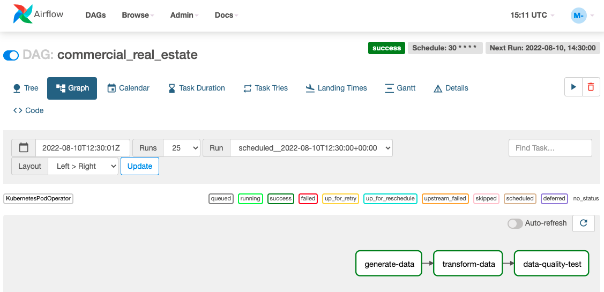

# Orchestrate the CRE report production
This DAG executes the end to end CRE pipeline.
The key steps are:
* Generate Data: runs a containerised python app that generates data
* Transform Data: runs a containerised dbt app that transforms the data in the format required
* Data Quality Tests: runs a containerised dbt app that executes data quality tests
